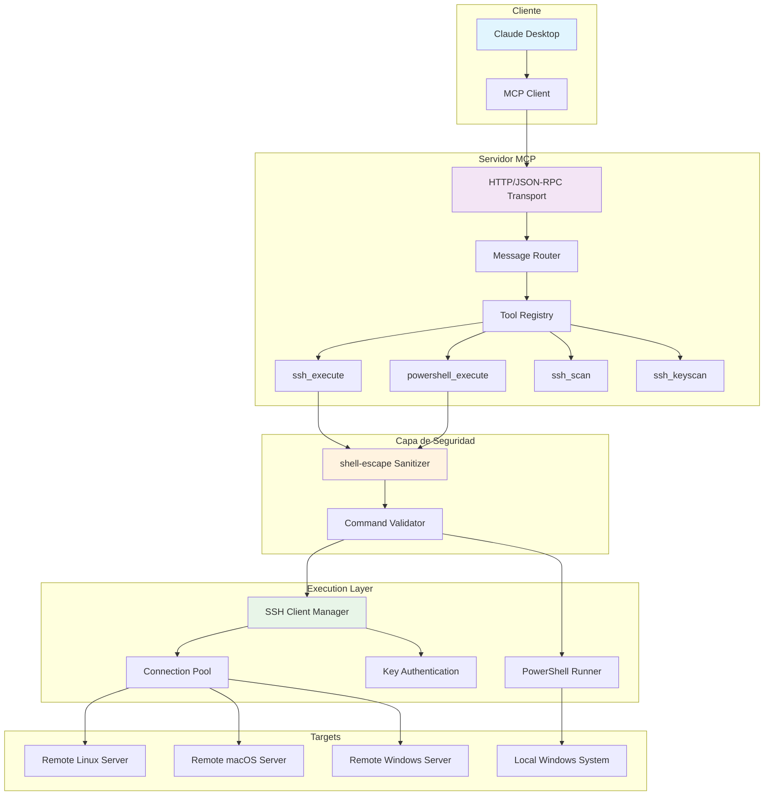
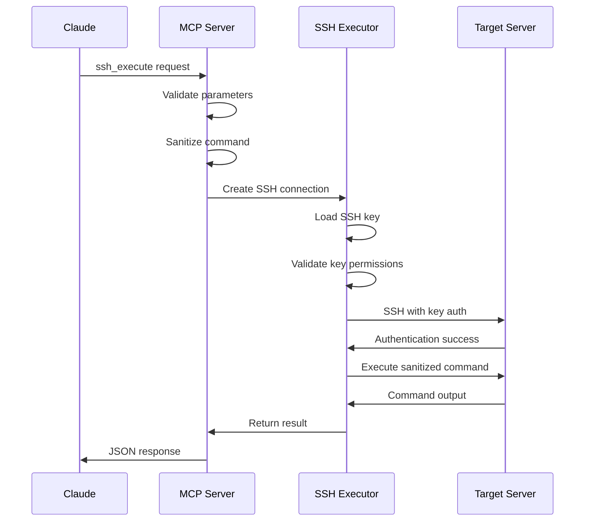
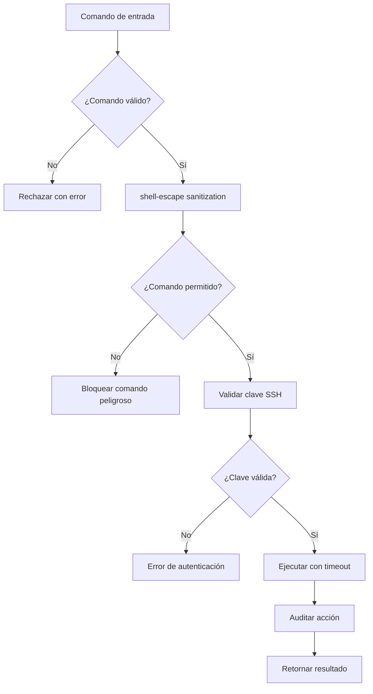
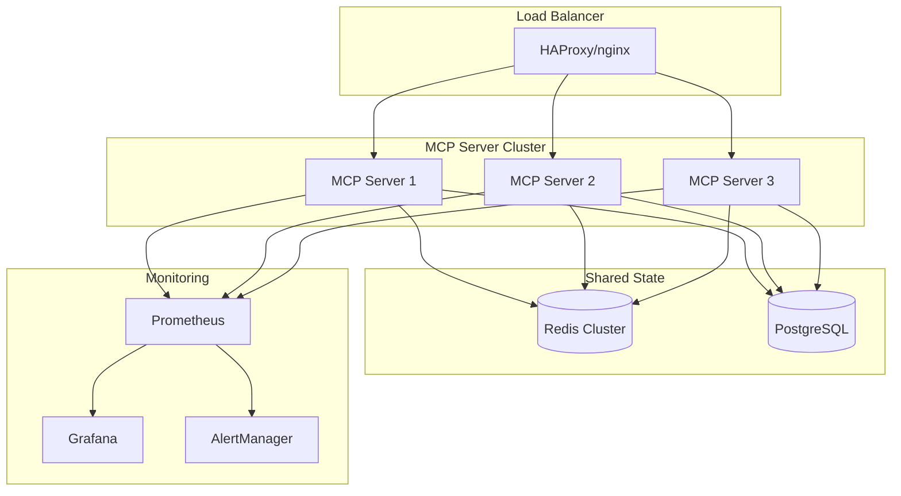

# 🏗️ Arquitectura del Sistema SSH-PowerShell MCP

<div align="center">

### 🔧 **Documentación Técnica Enterprise**
*Arquitectura, componentes, flujos de datos y especificaciones técnicas*

[](https://nodejs.org/)
[](https://modelcontextprotocol.io/)
[](#autenticación)
[](#seguridad)

</div>

---

## 🎯 **Visión General del Sistema**

### 📊 **Diagrama de Arquitectura**



---

## 🏛️ **Componentes del Sistema**

### 🌐 **1. MCP Server Core**

#### **📡 Transport Layer** (`src/transport.js`)
```javascript
class MCPTransport {
  constructor() {
    this.jsonrpc = '2.0';
    this.stdio = new StdioServerTransport();
  }
  
  async handleMessage(message) {
    // Procesa mensajes JSON-RPC 2.0
    // Enruta a handlers específicos
    // Maneja errores y responses
  }
}
```

#### **🛠️ Tool Registry** (`src/tools/index.js`)
```javascript
class ToolRegistry {
  constructor() {
    this.tools = new Map();
    this.registerDefaults();
  }
  
  register(name, schema, handler) {
    this.tools.set(name, {
      schema: this.validateSchema(schema),
      handler: this.wrapHandler(handler),
      metrics: new ToolMetrics(name)
    });
  }
}
```

---

### 🔐 **2. Capa de Seguridad**

#### **🛡️ Command Sanitizer** (Con `shell-escape`)
```javascript
import shellescape from 'shell-escape';

class CommandSanitizer {
  static sanitize(command, args = []) {
    // Sanitización avanzada con shell-escape
    if (Array.isArray(args)) {
      return shellescape([command, ...args]);
    }
    
    // Para comandos complejos, parsear y sanitizar
    const parsed = this.parseCommand(command);
    return shellescape(parsed);
  }
  
  static validateCommand(command) {
    const forbidden = [
      'rm -rf /',
      'dd if=',
      'mkfs.',
      'fdisk',
      'parted'
    ];
    
    return !forbidden.some(pattern => 
      command.toLowerCase().includes(pattern)
    );
  }
}
```

#### **🔑 SSH Key Manager** (Cross-Platform)
```javascript
class SSHKeyManager {
  static getDefaultKeyPath() {
    const os = require('os');
    const path = require('path');
    
    switch (process.platform) {
      case 'win32':
        return path.join(os.homedir(), '.ssh', 'id_rsa');
      case 'darwin':
      case 'linux':
        return path.join(os.homedir(), '.ssh', 'id_rsa');
      default:
        throw new Error(`Unsupported platform: ${process.platform}`);
    }
  }
  
  static validateKey(keyPath) {
    const fs = require('fs');
    try {
      const stats = fs.statSync(keyPath);
      
      // Verificar permisos en Unix/Linux/macOS
      if (process.platform !== 'win32') {
        const mode = stats.mode & parseInt('777', 8);
        if (mode !== parseInt('600', 8)) {
          throw new Error(`Key file ${keyPath} has insecure permissions: ${mode.toString(8)}`);
        }
      }
      
      return true;
    } catch (error) {
      throw new Error(`SSH key validation failed: ${error.message}`);
    }
  }
}
```

---

### ⚡ **3. Execution Engines**

#### **🔗 SSH Executor** (Enterprise Grade)
```javascript
class SSHExecutor {
  constructor(config = {}) {
    this.timeout = config.timeout || 30000;
    this.maxConcurrency = config.maxConcurrency || 5;
    this.connectionPool = new Map();
  }
  
  async execute(host, user, command, options = {}) {
    const keyPath = options.keyPath || SSHKeyManager.getDefaultKeyPath();
    SSHKeyManager.validateKey(keyPath);
    
    const sanitizedCommand = CommandSanitizer.sanitize(command);
    
    const sshArgs = [
      '-i', keyPath,
      '-o', 'ConnectTimeout=30',
      '-o', 'ServerAliveInterval=60',
      '-o', 'StrictHostKeyChecking=no',
      '-o', 'UserKnownHostsFile=/dev/null',
      `${user}@${host}`,
      sanitizedCommand
    ];
    
    return this.execWithTimeout('ssh', sshArgs, this.timeout);
  }
  
  async execWithTimeout(command, args, timeout) {
    const { spawn } = require('child_process');
    
    return new Promise((resolve, reject) => {
      const process = spawn(command, args, {
        stdio: ['pipe', 'pipe', 'pipe']
      });
      
      let stdout = '';
      let stderr = '';
      
      const timeoutId = setTimeout(() => {
        process.kill('SIGTERM');
        reject(new Error(`Command timeout after ${timeout}ms`));
      }, timeout);
      
      process.stdout.on('data', (data) => {
        stdout += data.toString();
      });
      
      process.stderr.on('data', (data) => {
        stderr += data.toString();
      });
      
      process.on('close', (code) => {
        clearTimeout(timeoutId);
        
        if (code === 0) {
          resolve({
            success: true,
            stdout: stdout.trim(),
            stderr: stderr.trim(),
            exitCode: code
          });
        } else {
          reject(new Error(`Command failed with exit code ${code}: ${stderr}`));
        }
      });
      
      process.on('error', (error) => {
        clearTimeout(timeoutId);
        reject(error);
      });
    });
  }
}
```

#### **⚡ PowerShell Executor** (Windows Optimized)
```javascript
class PowerShellExecutor {
  static async execute(command, options = {}) {
    const sanitizedCommand = CommandSanitizer.sanitize(command);
    const timeout = options.timeout || 30000;
    
    const psArgs = [
      '-NoProfile',
      '-NonInteractive',
      '-ExecutionPolicy', 'Bypass',
      '-Command', sanitizedCommand
    ];
    
    const { spawn } = require('child_process');
    
    return new Promise((resolve, reject) => {
      const process = spawn('powershell.exe', psArgs, {
        stdio: ['pipe', 'pipe', 'pipe'],
        windowsHide: true
      });
      
      let stdout = '';
      let stderr = '';
      
      const timeoutId = setTimeout(() => {
        process.kill();
        reject(new Error(`PowerShell timeout after ${timeout}ms`));
      }, timeout);
      
      process.stdout.on('data', (data) => {
        stdout += data.toString();
      });
      
      process.stderr.on('data', (data) => {
        stderr += data.toString();
      });
      
      process.on('close', (code) => {
        clearTimeout(timeoutId);
        
        resolve({
          success: code === 0,
          stdout: stdout.trim(),
          stderr: stderr.trim(),
          exitCode: code
        });
      });
    });
  }
}
```

---

### 🔍 **4. Network Discovery Engine**

#### **📡 SSH Scanner** (Optimized)
```javascript
class SSHScanner {
  static async scanNetwork(network, options = {}) {
    const { exec } = require('child_process');
    const util = require('util');
    const execAsync = util.promisify(exec);
    
    // Usar nmap para escaneo rápido y eficiente
    const nmapCommand = [
      'nmap',
      '-p', '22',
      '--open',
      '-sS',  // SYN scan (requiere privilegios)
      '-T4',  // Timing agressive
      '--host-timeout', '30s',
      network
    ].join(' ');
    
    try {
      const { stdout } = await execAsync(nmapCommand);
      return this.parseNmapOutput(stdout);
    } catch (error) {
      // Fallback a ping sweep si nmap falla
      return this.pingSweep(network);
    }
  }
  
  static parseNmapOutput(output) {
    const hosts = [];
    const lines = output.split('\n');
    
    let currentHost = null;
    for (const line of lines) {
      const hostMatch = line.match(/Nmap scan report for (.+)/);
      if (hostMatch) {
        currentHost = hostMatch[1];
      }
      
      if (line.includes('22/tcp open ssh') && currentHost) {
        hosts.push({
          host: currentHost,
          port: 22,
          service: 'ssh',
          status: 'open'
        });
      }
    }
    
    return hosts;
  }
}
```

---

## 🔄 **Flujos de Datos Detallados**

### 📊 **1. Flujo de Ejecución SSH**



### 🔒 **2. Flujo de Seguridad**



---

## 🎛️ **Configuración Avanzada**

### 🔧 **Variables de Entorno Enterprise**

```bash
# === CONFIGURACIÓN CORE ===
NODE_ENV=production                    # Modo de ejecución
MCP_SERVER_NAME=ssh-powershell-prod   # Nombre del servidor
LOG_LEVEL=info                        # debug|info|warn|error

# === CONFIGURACIÓN SSH ===
SSH_KEY_PATH=/opt/keys/production_rsa  # Clave SSH personalizada
SSH_TIMEOUT=45000                      # Timeout SSH (ms)
SSH_CONNECT_TIMEOUT=30                 # Timeout conexión (s)
SSH_MAX_RETRIES=3                      # Reintentos automáticos

# === CONFIGURACIÓN SEGURIDAD ===
SECURITY_MODE=strict                   # strict|permissive|audit
ALLOW_DANGEROUS_COMMANDS=false         # Comandos peligrosos
AUDIT_LOG_ENABLED=true                 # Logging de auditoría
AUDIT_LOG_PATH=/var/log/ssh-mcp.log   # Ruta de auditoría

# === CONFIGURACIÓN PERFORMANCE ===
MAX_CONCURRENT_SSH=15                  # Conexiones SSH concurrentes
CONNECTION_POOL_SIZE=10                # Tamaño pool conexiones
COMMAND_CACHE_TTL=300                  # Cache comandos (s)
RATE_LIMIT_PER_MINUTE=100             # Límite de comandos/min

# === CONFIGURACIÓN ALERTAS ===
ALERT_EMAIL=admin@company.com          # Email alertas
ALERT_WEBHOOK=https://hooks.slack.com  # Webhook notificaciones
ALERT_FAILED_AUTH_THRESHOLD=5          # Umbral fallos auth
ALERT_HIGH_CPU_THRESHOLD=80            # Umbral CPU (%)

# === CONFIGURACIÓN COMPLIANCE ===
GDPR_ENABLED=true                      # Cumplimiento GDPR
SOX_ENABLED=true                       # Cumplimiento SOX
HIPAA_ENABLED=false                    # Cumplimiento HIPAA
DATA_RETENTION_DAYS=90                 # Retención logs (días)
```

### 📝 **Configuración SSH Avanzada**

```bash
# ~/.ssh/config - Configuración SSH profesional
Host production-*
    IdentityFile ~/.ssh/production_rsa
    StrictHostKeyChecking yes
    UserKnownHostsFile ~/.ssh/known_hosts_prod
    ConnectTimeout 30
    ServerAliveInterval 60
    ServerAliveCountMax 3
    Compression yes
    TCPKeepAlive yes
    ForwardAgent no
    ForwardX11 no
    PasswordAuthentication no
    PubkeyAuthentication yes
    PreferredAuthentications publickey
    
Host staging-*
    IdentityFile ~/.ssh/staging_rsa
    StrictHostKeyChecking no
    UserKnownHostsFile ~/.ssh/known_hosts_staging
    ConnectTimeout 15
    
Host development-*
    IdentityFile ~/.ssh/development_rsa
    StrictHostKeyChecking no
    UserKnownHostsFile /dev/null
    LogLevel QUIET
```

---

## 📊 **Métricas y Observabilidad**

### 📈 **Sistema de Métricas Integrado**

```javascript
class MetricsCollector {
  constructor() {
    this.metrics = {
      ssh_connections_total: 0,
      ssh_connections_failed: 0,
      commands_executed: 0,
      avg_response_time: 0,
      active_connections: 0,
      security_violations: 0
    };
    
    this.startMetricsCollection();
  }
  
  recordSSHConnection(success, responseTime) {
    this.metrics.ssh_connections_total++;
    if (!success) {
      this.metrics.ssh_connections_failed++;
    }
    
    this.updateAverageResponseTime(responseTime);
  }
  
  recordSecurityViolation(type, details) {
    this.metrics.security_violations++;
    this.alertManager.send({
      type: 'security_violation',
      severity: 'high',
      details: details,
      timestamp: new Date().toISOString()
    });
  }
  
  getHealthCheck() {
    const failureRate = this.metrics.ssh_connections_failed / 
                       Math.max(this.metrics.ssh_connections_total, 1);
    
    return {
      status: failureRate < 0.1 ? 'healthy' : 'degraded',
      metrics: this.metrics,
      uptime: process.uptime(),
      memory: process.memoryUsage(),
      cpu: process.cpuUsage()
    };
  }
}
```

### 🚨 **Sistema de Alertas**

```javascript
class AlertManager {
  constructor(config) {
    this.emailConfig = config.email;
    this.webhookConfig = config.webhook;
    this.thresholds = config.thresholds;
  }
  
  async send(alert) {
    // Determinar severidad y canales
    const channels = this.getChannelsForSeverity(alert.severity);
    
    // Enviar a múltiples canales
    const promises = channels.map(channel => {
      switch (channel.type) {
        case 'email':
          return this.sendEmail(alert, channel);
        case 'webhook':
          return this.sendWebhook(alert, channel);
        case 'pagerduty':
          return this.sendPagerDuty(alert, channel);
        default:
          console.warn(`Unknown alert channel: ${channel.type}`);
      }
    });
    
    await Promise.allSettled(promises);
  }
  
  async sendEmail(alert, channel) {
    const nodemailer = require('nodemailer');
    const transporter = nodemailer.createTransporter(channel.config);
    
    await transporter.sendMail({
      from: channel.from,
      to: channel.to,
      subject: `[${alert.severity.toUpperCase()}] SSH-MCP Alert: ${alert.type}`,
      html: this.formatAlertHTML(alert)
    });
  }
}
```

---

## 🔄 **Patrones de Escalabilidad**

### 🏗️ **Arquitectura para High Availability**



### 🐳 **Deployment con Kubernetes**

```yaml
# k8s/deployment.yaml
apiVersion: apps/v1
kind: Deployment
metadata:
  name: ssh-mcp-server
  labels:
    app: ssh-mcp
    version: v1.0.0
spec:
  replicas: 3
  strategy:
    type: RollingUpdate
    rollingUpdate:
      maxSurge: 1
      maxUnavailable: 0
  selector:
    matchLabels:
      app: ssh-mcp
  template:
    metadata:
      labels:
        app: ssh-mcp
    spec:
      securityContext:
        runAsNonRoot: true
        runAsUser: 1000
        fsGroup: 1000
      containers:
      - name: ssh-mcp
        image: ssh-mcp:1.0.0
        ports:
        - containerPort: 3000
          name: http
        env:
        - name: NODE_ENV
          value: "production"
        - name: SSH_KEY_PATH
          value: "/etc/ssh-keys/id_rsa"
        - name: REDIS_URL
          valueFrom:
            secretKeyRef:
              name: redis-secret
              key: url
        volumeMounts:
        - name: ssh-keys
          mountPath: /etc/ssh-keys
          readOnly: true
        - name: config
          mountPath: /app/config
        resources:
          requests:
            memory: "128Mi"
            cpu: "100m"
          limits:
            memory: "512Mi"
            cpu: "500m"
        livenessProbe:
          httpGet:
            path: /health
            port: 3000
          initialDelaySeconds: 30
          periodSeconds: 10
        readinessProbe:
          httpGet:
            path: /ready
            port: 3000
          initialDelaySeconds: 5
          periodSeconds: 5
      volumes:
      - name: ssh-keys
        secret:
          secretName: ssh-keys
          defaultMode: 0600
      - name: config
        configMap:
          name: ssh-mcp-config
```

---

## 🔐 **Seguridad Enterprise**

### 🛡️ **Matriz de Amenazas y Mitigaciones**

| Amenaza | Impacto | Probabilidad | Mitigación Implementada |
|---------|---------|--------------|------------------------|
| **Inyección de Comandos** | Alto | Medio | `shell-escape` sanitization + whitelist |
| **Credenciales Expuestas** | Alto | Bajo | SSH keys + no hardcoded passwords |
| **DoS por Conexiones** | Medio | Medio | Connection pooling + rate limiting |
| **Acceso No Autorizado** | Alto | Bajo | Key-based auth + audit logging |
| **Escalación de Privilegios** | Alto | Bajo | Non-root execution + validation |
| **Data Exfiltration** | Medio | Bajo | Command monitoring + DLP |

### 🔍 **Auditoría y Compliance**

```javascript
class AuditLogger {
  constructor(config) {
    this.logPath = config.auditLogPath || '/var/log/ssh-mcp-audit.log';
    this.rotationSize = config.rotationSize || '100MB';
    this.retentionDays = config.retentionDays || 90;
    
    this.initializeLogger();
  }
  
  logSSHAccess(event) {
    const auditEvent = {
      timestamp: new Date().toISOString(),
      event_type: 'ssh_access',
      source_ip: event.sourceIP,
      target_host: event.targetHost,
      user: event.user,
      command: this.hashCommand(event.command), // Hash for privacy
      success: event.success,
      session_id: event.sessionId,
      compliance_flags: this.getComplianceFlags(event)
    };
    
    this.writeAuditLog(auditEvent);
  }
  
  getComplianceFlags(event) {
    const flags = [];
    
    if (process.env.GDPR_ENABLED === 'true') {
      flags.push('GDPR');
    }
    
    if (process.env.SOX_ENABLED === 'true') {
      flags.push('SOX');
    }
    
    if (this.isPIICommand(event.command)) {
      flags.push('PII_ACCESS');
    }
    
    return flags;
  }
}
```

---

## 📚 **Patrones de Diseño Utilizados**

### 🏭 **Factory Pattern** - Tool Creation
```javascript
class ToolFactory {
  static createTool(type, config) {
    switch (type) {
      case 'ssh_execute':
        return new SSHExecuteTool(config);
      case 'powershell_execute':
        return new PowerShellExecuteTool(config);
      case 'ssh_scan':
        return new SSHScanTool(config);
      default:
        throw new Error(`Unknown tool type: ${type}`);
    }
  }
}
```

### 🏛️ **Strategy Pattern** - Authentication Methods
```javascript
class AuthenticationStrategy {
  static getStrategy(type) {
    const strategies = {
      'ssh_key': new SSHKeyAuthentication(),
      'password': new PasswordAuthentication(),
      'certificate': new CertificateAuthentication()
    };
    
    return strategies[type] || strategies['ssh_key'];
  }
}
```

### 🎭 **Observer Pattern** - Event Monitoring
```javascript
class EventEmitter {
  constructor() {
    this.listeners = new Map();
  }
  
  on(event, callback) {
    if (!this.listeners.has(event)) {
      this.listeners.set(event, []);
    }
    this.listeners.get(event).push(callback);
  }
  
  emit(event, data) {
    const callbacks = this.listeners.get(event) || [];
    callbacks.forEach(callback => callback(data));
  }
}
```

---

## 🚀 **Roadmap Técnico**

### 📅 **Versión 2.0** (Q1 2024)
- 🔐 **Certificados SSH** como método de autenticación
- 🌐 **API REST** complementaria al protocolo MCP
- 📊 **Dashboard web** para monitoreo en tiempo real
- 🔄 **Auto-discovery** de infraestructura

### 📅 **Versión 3.0** (Q2 2024)
- 🤖 **AI-powered** command optimization
- 🛡️ **Zero-trust** security model
- 📱 **Mobile app** para administración remota
- 🌍 **Multi-cloud** deployment automation

---

<div align="center">

### 🏗️ **Arquitectura Diseñada para el Futuro**

*Escalable | Segura | Observável | Enterprise-Ready*

**SSH-PowerShell MCP Server - Conectando IA con Infraestructura**

</div>